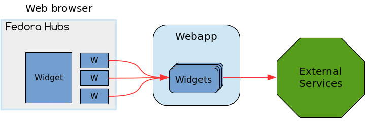

Create a very simple widget
===========================

Description of widgets
----------------------

The hub page is composed of a header, a left menu, and two main columns with
information components called widgets. The Hubs framework is extensible when it
comes to widgets, which means you can write your own. That's what you'll do in
this workshop.

Each widget gets its data asynchronously from the Hubs webapp, after the page
has loaded. The backend widget components can make queries to external services
(Bodhi, Bugzilla, Pagure, Github, Badges, etc.) to retrieve the information to
display.

Basic code structure
--------------------

.. note::

    You will be editing files in the ``widget-workshop`` repository. You don't
    need to edit those files inside the VM: the contents of your git clone will
    be synchronized in real time with the directory inside the VM. As a
    consequence, you don't need to connect to the VM for this section of the
    tutorial.

The ``widget`` directory in the ``widget-workshop`` repository contains the
basic directory structure for a new widget. In addition to the usual files for
a Python package (``setup.py`` and ``LICENSE.txt``), it contains a
``workshop_widget`` directory where the widget code will live.

A widget is composed of at least 3 parts:

 * The widget class, inheriting from ``hubs.widgets.base.Widget``
 * A view class for the widget's root URL, inheriting from
   ``hubs.widgets.view.RootWidgetView``
 * A template file that the view class will render using
   `Jinja2 <http://jinja.pocoo.org>`_.

Both Python classes can reside in the directory's ``__init__.py`` file.

Add the following code to ``workshop_widget/__init__.py``::

    from hubs.widgets.base import Widget

    class WorkshopWidget(Widget):

        name = "workshop-widget"
        position = "both"

This will create the minimal class to have your widget accepted by the Hubs
framework. But you still need a root view class, so add the following code to
``workshop_widget/__init__.py``::

    from hubs.widgets.view import RootWidgetView

    class BaseView(RootWidgetView):
        pass

You don't even need to override anything from the base class if you're using
the defaults. Now you need the Jinja2 template file, which defaults to
``templates/root.html`` for the root view. An empty file is provided, fill it
up with this content:

.. code-block:: jinja

    

    
    This is the content of the workshop widget.
    

If you want a static HTML widget, you don't need more.
