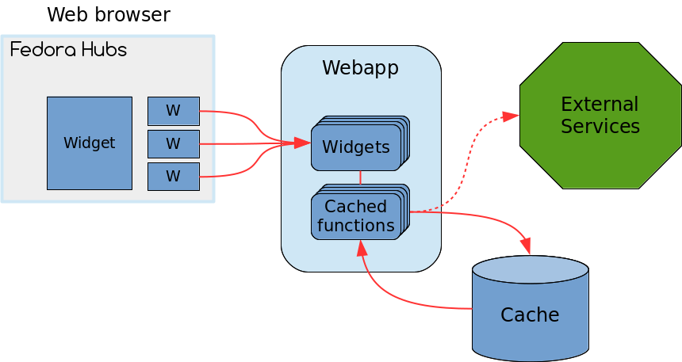

Cache the data
==============

Integrated caching
------------------

In the current situation, an XMLRPC query is sent to Bugzilla on each page
load. As we don't want to be hammering our poor old Bugzilla that way, we will
setup some caching for our query. Of course, as soon as caching is considered,
one must think of how the cache is going to be invalidated. This will be the
subject of the next section, in this one we will simply focus on using the
cache.

Hubs provides a simple system for widgets to cache their data, it is the
concept of a "cached function". They can be used for any long-running operation
that returns a serializable value. Widgets can have zero or more cached
functions.

Writing a cached function
-------------------------

To create a cached function, we simply create a subclass of
``hubs.widgets.caching.CachedFunction``. Edit the
``workshop_widget/__init__.py`` to add this code::

    from hubs.widgets.caching import CachedFunction

    class GetReviews(CachedFunction):

        def execute(self):
            email = self.instance.config["email"]
            if not email:
                return {}
            return get_package_reviews(email)

        def should_invalidate(self, message):
            return False  # We'll implement that later.

Note that the implemented ``execute()`` method does mostly the same thing as
the view's ``get_context()`` method. This is normal, the cached function is
going to do most of the work now.

Now edit the root view's ``get_context()`` method to look like this::

    def get_context(self, instance, *args, **kwargs):
        get_reviews = GetReviews(instance)
        return {"reviews": get_reviews()}

This is how a cached function must be used: the class is instantiated with the
widget instance as the only argument, and then this instance is executed to get
the result.

This is all you have to do. Upon execution, the ``execute()`` method will be
called and the results will be stored in Hub's general cache. Subsequent calls
will hit the cache. If you change the email address in your widget's
configuration, the ``CachedFunction`` instance will know to ditch the cache and
call the ``execute()`` method again, storing the new results.

Hopefully, the speedup will be visible when you reload your browser two times.
The first reload should be slow, as the cache is being populated, but the
second one should be faster.
