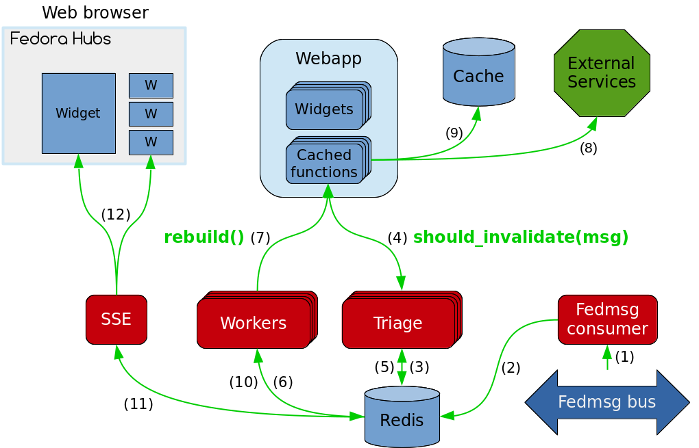

Invalidate the cache
====================

    There are only two hard things in Computer Science: cache invalidation and
    naming things.  -- Phil Karlton

Now that the data is in the Hubs cache, it will stay there forever unless there
is a configuration change or the cache is full and the data is evicted.
Of course, this isn't satisfactory since the status of package requests can
change quickly. Not always as quickly as one would wish, but that's another
story.

How the cache invalidation works
--------------------------------

Fedora Hubs uses Fedmsg to invalidate widget caches. Hubs declares a component
in ``hubs.backend.consumer`` that will subscribe to messages when
``fedmsg-hub`` starts. This is what happens when a message is published on the
bus:

* The "Consumer" component stores the message in a Redis queue (steps 1 & 2 on
  the schema)
* One of the "Triage" daemons (``hubs.backend.triage``) picks it up from the
  Redis queue (3), and passes this message to each cached function's
  ``should_invalidate()`` method (4). This method returns ``True`` if the
  message should cause the cache to be invalidated, ``False`` otherwise. If
  it is ``True``, the Triage worker will then add the reference of the cached
  function (and the widget it belongs to) to another Redis queue (5).
* One of the "Worker" daemons (``hubs.backend.worker``) picks it up from that
  Redis queue (6), and rebuilds the widget's cache by running the ``rebuild()``
  method (7), which will call the cached function's ``execute()`` method (8)
  and store the results in the cache (9).
  Then, it will add a reference to the widget to yet another Redis queue (10).
* The "SSE" daemon will read from that last Redis queue (11) and send an SSE
  message to the connected browsers that are currently displaying the widget
  (12). The Javascript in the page will reload the widget in-place, displaying
  the new information.

Adding automatic reloading
--------------------------

To benefit from Fedmsg-based cache invalidation and automatic reloading, a
widget author must only implement the ``should_invalidate()`` method of their
cached function(s).

Replace the current ``GetReviews.should_invalidate()`` method with the
following code::

    def should_invalidate(self, message):
        if ".bugzilla.bug." not in message["topic"]:
            return False
        try:
            product = message['msg']['bug']['product']
            component = message['msg']['bug']['component']
            reporter = message['msg']['bug']['reporter']
        except KeyError:
            return False
        return (
            product == "Fedora" and
            component == "Package Review" and
            reporter == self.instance.config["email"]
            )

This implementation will first check if the message is about Bugzilla, then
test if it is a package review and if the reporter is the configured email
address. In that case the method will return ``True``, otherwise it will return
``False``.

.. note::

   The structure of the messages emitted by Bugzilla is available
   `in this Fedmsg documentation
   <http://fedora-fedmsg.readthedocs.io/en/latest/topics.html#bugzilla>`_.

You may have noticed that this implementation will cause the cache to be
rebuilt more than necessary, for example if a comment is added to the ticket
but the review state didn't change. While it is true that this could be
improved, remember that the "Worker" daemon will rebuild the cache in the
background, and as a result the UI will never be slowed down by an empty cache.
The worst that will happen here is useless XMLRPC queries to Bugzilla.

Now restart the Hubs framework with ``honcho start``. This is the perfect time
to review a friends' package request, just to test your work of course! :-p
Just remember to set your friend's email in the widget configuration and watch
the bug change state in Hubs!
